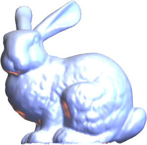
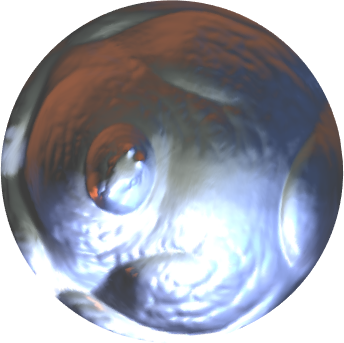

<h1 align="left"> Distortion Balancing Parameterization</h1>

  
  

 

This repository provides an implementation of a parameterization balancing between angle and area distortion of open triangular meshes.

If you use this code in your own work, please cite the following paper:

> [1] **S.-Y. Liu** and **M.-H. Yueh**,  
> *Energy-Based Distortion-Balancing Parameterization for Open Surfaces*,  
> [doi: 10.1137/24M1708437](https://doi.org/10.1137/24M1708437).

---

### Main Function
- `[uv, VB, VI] = DiskBEM(F, V)`
- `[uv, VB, VI] = SquareBEM(F, V)`

Required Input:
* `F`: `#F x 3` triangulations of an open triangle mesh
* `V`: `#V x 3` vertex coordinates of an open triangle mesh

Output:
- `uv`: `#V x 2` vertex coordinates of the disk(sqreare)-shaped distortion-balancing map
- `VI`: indices of interior vertices
- `VB`: indices of boundary vertices

---

### License

This software is released for academic and research purposes only.  
Commercial use is not permitted without prior written permission from the authors.

© 2024 Shu-Yung Liu and Mei-Heng Yueh
